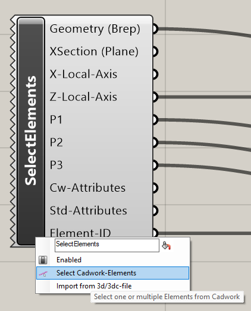
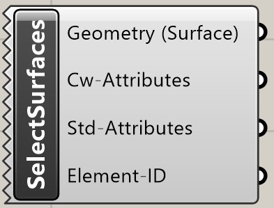
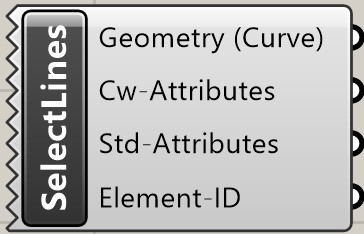
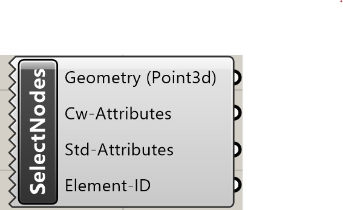

## Select Element(s)

Ein Rechtsklick auf das Icon ruft das Kontext-Menü auf.
Mit der Funktion **Select Elements** können cadwork Brep-Elemente (Stab, Platte, Hilfsvolumen, Bolzen) sowie 3d/3dc Dateien selektiert und mit Grasshopper verknüpft werden.

{: style="width:600px"}

| Input | comment                                     |
| ----- | :------------------------------------------ |
| None  | Elemente via Kontext Menü wählen/hinzufügen |

| Output         | comment                     |
| -------------- | :-------------------------- |
| Geometry       | Geometrie(n) in einer Liste |
| XSection       | Konstruktionsebene          |
| X-Local-Axis   | X-Achse                     |
| Z-Local-Axis   | Z-Achse                     |
| P1             | Achspunkt 1                 |
| P2             | Achspunkt 2                 |
| P3             | Achspunkt 3                 |
| Cw-Attributes  | User Attribute              |
| Std-Attributes | Standard Attribute          |
| Element-ID     | Element ID                  |

## Select Surface(s)

Ein Rechtsklick auf das Icon ruft das Kontext-Menü auf.
Mit der Funktion **Select Elements** können Flächen selektiert und mit Grasshopper verknüpft werden.

| Input | comment                                     |
| ----- | :------------------------------------------ |
| None  | Elemente via Kontext Menü wählen/hinzufügen |

| Output         | comment                 |
| -------------- | :---------------------- |
| Geometry       | Elemente in einer Liste |
| Cw-Attributes  | User Attribute          |
| Std-Attributes | Standard Attribute      |
| Element-ID     | Element ID              |

## Select Line(s)

Ein Rechtsklick auf das Icon ruft das Kontext-Menü auf.
Mit der Funktion **Select Elements** können Linien selektiert und mit Grasshopper verknüpft werden.

| Input | comment                                     |
| ----- | :------------------------------------------ |
| None  | Elemente via Kontext Menü wählen/hinzufügen |

| Output         | comment                 |
| -------------- | :---------------------- |
| Geometry       | Elemente in einer Liste |
| Cw-Attributes  | User Attribute          |
| Std-Attributes | Standard Attribute      |
| Element-ID     | Element ID              |

## Select Node(s)

Ein Rechtsklick auf das Icon ruft das Kontext-Menü auf.
Mit der Funktion **Select Elements** können Knoten selektiert und mit Grasshopper verknüpft werden.

| Input | comment                                     |
| ----- | :------------------------------------------ |
| None  | Elemente via Kontext Menü wählen/hinzufügen |

| Output         | comment                 |
| -------------- | :---------------------- |
| Geometry       | Elemente in einer Liste |
| Cw-Attributes  | User Attribute          |
| Std-Attributes | Standard Attribute      |
| Element-ID     | Element ID              |
