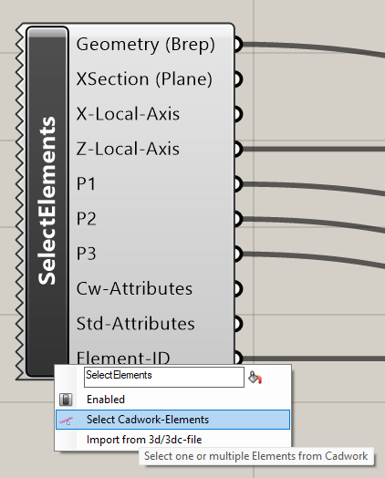
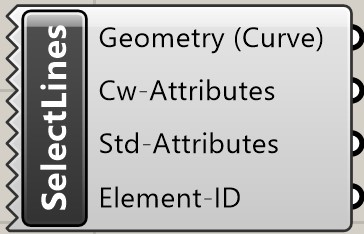
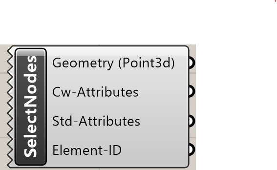

## Select Element(s)

Un clic droit sur l'icône appelle le menu contextuel.
La fonction **Select Elements** permet de sélectionner des éléments cadwork Brep (barre, plaque, volume auxiliaire, boulon) ainsi que des fichiers 3d/3dc et de les lier à Grasshopper.

{: style="width:600px"}

| Input | comment                                                  |
| ----- | :------------------------------------------------------- |
| None  | Sélectionner/ajouter des éléments via le menu contextuel |

| Output           | comment                  |
| ---------------- | :----------------------- |
| OutputBrep       | éléments dans une liste  |
| OutputXSectPlane | Restitution du niveau XY |
| X-Local-Axis     | X-axe                    |
| Z-Local-Axis     | Z-axe                    |
| P1               | Point d'axe 1            |
| P2               | Point d'axe 2            |
| P3               | Point d'axe 3            |
| OutputCwAttr     | attributs utilisateur    |
| OutputStdAttr    | attributs standard       |
| Element-ID       | Element ID               |

## Select Surface(s)

Un clic droit sur l'icône fait apparaître le menu contextuel.
La fonction **Select Elements** permet de sélectionner des surfaces et de les lier à Grasshopper.

| Input | comment                                                  |
| ----- | :------------------------------------------------------- |
| None  | Sélectionner/ajouter des éléments via le menu contextuel |

| Output        | comment                 |
| ------------- | :---------------------- |
| OutputSurface | éléments dans une liste |
| OutputCwAttr  | attributs utilisateur   |
| OutputStdAttr | attributs standard      |
| Element-ID    | Element ID              |

## Select Line(s)

Un clic droit sur l'icône fait apparaître le menu contextuel.
La fonction **Select Elements** permet de sélectionner des lignes et de les lier à Grasshopper.

| Input | comment                                                  |
| ----- | :------------------------------------------------------- |
| None  | Sélectionner/ajouter des éléments via le menu contextuel |

| Output        | comment                 |
| ------------- | :---------------------- |
| OutputLine    | éléments dans une liste |
| OutputCwAttr  | attributs utilisateur   |
| OutputStdAttr | attributs standard      |
| Element-ID    | Element ID              |

## Select Node(s)

Un clic droit sur l'icône fait apparaître le menu contextuel.
La fonction **Select Elements** permet de sélectionner des nœuds et de les associer à Grasshopper.

| Input | comment                                                  |
| ----- | :------------------------------------------------------- |
| None  | Sélectionner/ajouter des éléments via le menu contextuel |

| Output        | comment                 |
| ------------- | :---------------------- |
| OutputNode    | éléments dans une liste |
| OutputCwAttr  | attributs utilisateur   |
| OutputStdAttr | attributs standard      |
| Element-ID    | Element ID              |
